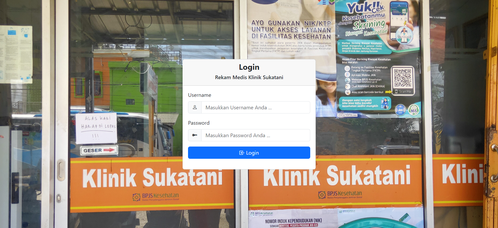
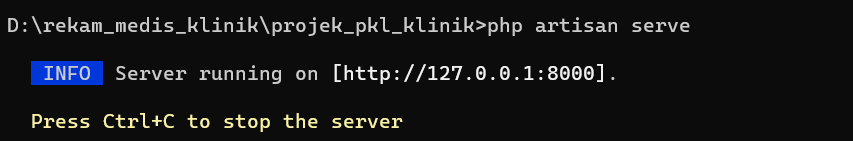

# Rekam Medis Klinik 
Proyek Rekam Medis Klinik adalah inisiatif yang bertujuan untuk memperkenalkan sistem rekam medis elektronik di sebuah klinik. 
Sistem ini akan menggantikan metode tradisional yang masih menggunakan catatan manual dalam mencatat dan mengelola informasi pasien.
Deskripsi proyek ini melibatkan pengembangan dan implementasi solusi teknologi yang memungkinkan dokter dan staf medis klinik untuk mengelola data pasien secara efisien, akurat, dan aman. Manfaat dari proyek Rekam Medis Klinik ini adalah peningkatan efisiensi operasional, pengurangan kesalahan manusia, peningkatan kolaborasi antara staf medis, dan perbaikan pelayanan pasien. Dengan sistem rekam medis elektronik yang terintegrasi, klinik akan memiliki akses cepat dan akurat terhadap informasi medis pasien, yang dapat membantu dalam diagnosis, pengobatan, dan perawatan yang lebih baik secara keseluruhan.

#   Cara Instalisasi
    # Buka Terminal/CMD 
    # Sesuaikan direktori aplikasi dengan CMD
    # Jalankan Local Server Anda (Saya menggunakan local server -> XAMPP)
        # Jalankan APACE dan MySQl
        # Pastikan Local Server Anda mendukung versi PHP diatas 8.0.0
    # buat sebuah database baru
    # import file db_klinik_sukatani.sql kedalam database baru
    # Buka folder aplikasi di code editor Anda (Saya Menggunakan code editor -> Vs Code)
    # Buka file .env kemudian sesuaikan:
        -> DB_DATABASE= nama_database_yang_Anda_Buat
        -> DB_USERNAME= Nama_Username_database_Anda(*Jika Ada)
        -> DB_PASSWORD= Password_database_Anda(*Jika Ada)
    # Jalankan Pada terminal/CMD "php artisan serv / php artisan serve"
    # kemudian buka port yang ditunjukkan 

    # Aplikasi berhasil diinstall, jika terkendala dalam penginstallan
        -> dapat menghubungi email berikut: mping593@gmail.com
        -> pastikan sertakan print screen error yang terjadi

# username yang dapat Anda gunakan:
    # test@gmail.com
    # test1@gmail.com
    # test2@gmail.com
    # test3@gmail.com
# password untuk username diatas:
    # password default adalah : 123456

